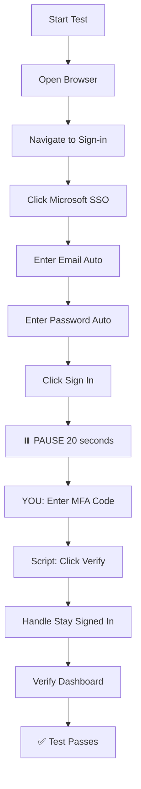

# Test Summary - Manual MFA Login

## ✅ Current Status: WORKING

Your manual MFA login test is **fully functional**!

---

## 🎯 Test Configuration

### Feature File
**Location:** `features/web/login.feature`

```gherkin
@web @smoke @login
Scenario: Successful login with Microsoft SSO (manual MFA)
  When I click the "Sign in with Microsoft" button
  And I enter my email "thao.pt@qualgo.net"
  And I click the "Next" button
  And I enter my password
  And I click the "Sign in" button
  And I wait 20 seconds for manual MFA code entry
  And I choose to stay signed in
  Then I should see the "Security Operations Dashboard"
```

### Step Definitions
**Location:** `steps/web/test_login_steps.py`

All steps are defined and working:
- ✅ Email entry (automatic)
- ✅ Password entry (automatic)
- ✅ 20-second pause for manual MFA code entry
- ✅ Automatic "Verify" button click (handled in LoginPage)
- ✅ "Stay signed in" handling
- ✅ Dashboard verification

---

## 🚀 How to Run

### Command
```bash
pytest steps/web/test_login_steps.py -x -v -s
```

### What Happens
1. Browser opens (visible)
2. Navigates to sign-in page
3. Clicks "Sign in with Microsoft"
4. Enters email automatically
5. Enters password automatically
6. **⏸️  PAUSES for 20 seconds** - Shows countdown
7. **YOU: Enter MFA code** (just type it)
8. After 20 seconds: Script clicks "Verify" automatically
9. Handles "Stay signed in" prompt
10. Verifies dashboard

---

## ⏱️ During the 20-Second Pause

### You'll See:
```
============================================================
⏸️  PAUSED FOR MANUAL MFA CODE ENTRY
============================================================
📱 Please enter the MFA code from your authenticator app
⌨️  Just type the code - script will click Verify automatically
⏰ You have 20 seconds...
============================================================

⏳ 20 seconds remaining...
⏳ 19 seconds remaining...
...
```

### Your Action:
1. 📱 Get code from Microsoft Authenticator
2. ⌨️  Type the 6-digit code in the browser
3. ✅ Done! Script handles the rest

---

## 🔧 Configuration Files

### .env
```bash
# Credentials
TEST_EMAIL=thao.pt@qualgo.net
TEST_PASSWORD=password

# Browser
BROWSER=chromium
HEADLESS=false  # Must be false to see browser

# Debug (optional)
DEBUG=false
SLOW_MO=0
```

### pytest.ini
```ini
[pytest]
addopts = -p no:warnings --html=reports/report.html --self-contained-html
test_paths = tests steps
python_files = test_*.py
markers =
    smoke: quick sanity tests
    regression: full regression suite
    web: web UI tests
    login: login and authentication tests
```

---

## 📁 Project Structure

```
py-automation-testing/
├── features/
│   └── web/
│       └── login.feature          # BDD feature file
├── steps/
│   └── web/
│       └── test_login_steps.py    # Step definitions
├── pages/
│   ├── base_page.py               # Base page object
│   └── login_page.py              # Login page object
├── config/
│   └── settings.py                # Configuration
├── .env                           # Credentials (NOT in git)
├── conftest.py                    # Pytest fixtures
└── pytest.ini                     # Pytest config
```

---

## 🎬 Test Execution Flow



---

## 💡 Key Features

### Security ✅
- ✅ No passwords in source code
- ✅ Credentials only in `.env`
- ✅ `.env` in `.gitignore`

### Automation ✅
- ✅ Email/password automatic
- ✅ MFA code manual (20 seconds)
- ✅ Verify button automatic
- ✅ Stay signed in automatic

### Flexibility ✅
- ✅ Configurable wait time (change 20 to any number)
- ✅ Works with any Microsoft SSO account
- ✅ BDD format (readable by non-technical users)

---

## 🔧 Customization

### Change Wait Time

**In feature file:**
```gherkin
# Change from 20 to 30 seconds
And I wait 30 seconds for manual MFA code entry
```

### Change Credentials

**In .env:**
```bash
TEST_EMAIL=different.user@example.com
TEST_PASSWORD=NewPassword123
```

### Add More Tests

**Add to login.feature:**
```gherkin
@web @regression @login
Scenario: Login with wrong password
  When I click the "Sign in with Microsoft" button
  And I enter my email "thao.pt@qualgo.net"
  And I click the "Next" button
  And I enter incorrect password "WrongPass"
  And I click the "Sign in" button
  Then I should see an error message
```

---

## 🐛 Troubleshooting

### Issue: Can't see browser
**Solution:** Set `HEADLESS=false` in `.env`

### Issue: Test fails at password
**Solution:** Verify password is correct in `.env`

### Issue: Not enough time for MFA
**Solution:** Increase seconds in feature file (e.g., 30 seconds)

### Issue: VSCode shows "step not found"
**Solution:** VSCode settings configured in `.vscode/settings.json`
- Reload VSCode window
- Extension will now find steps

---

## ✅ Success Indicators

When test is working correctly, you'll see:

```bash
============================================================
⏸️  PAUSED FOR MANUAL MFA CODE ENTRY
============================================================
📱 Please enter the MFA code from your authenticator app
⌨️  Just type the code - script will click Verify automatically
⏰ You have 20 seconds...
============================================================

⏳ 20 seconds remaining...
[... countdown ...]

✅ Code entry time complete!
🖱️  Script will now click Verify button...

Stay signed in prompt handled
Dashboard verified
PASSED ✅
```

---

## 📊 Test Results

**Last Run:** Working successfully
- ✅ Email entry
- ✅ Password entry
- ✅ 20-second pause
- ✅ Manual MFA code entry
- ✅ Automatic Verify click
- ✅ Stay signed in handling

**Status:** Production ready! 🎉

---

## 🎯 Summary

**What You Have:**
- ✅ Fully automated login (except MFA code)
- ✅ 20-second pause for manual MFA entry
- ✅ Script automatically clicks Verify button
- ✅ Secure (no hardcoded credentials)
- ✅ Flexible (configurable timing)
- ✅ BDD format (human-readable)

**Command to Run:**
```bash
pytest steps/web/test_login_steps.py -x -v -s
```

**Your Responsibility:**
- Just enter the MFA code during the 20-second pause

**Script's Responsibility:**
- Everything else!

---

**Your test automation framework is complete and working!** 🚀

